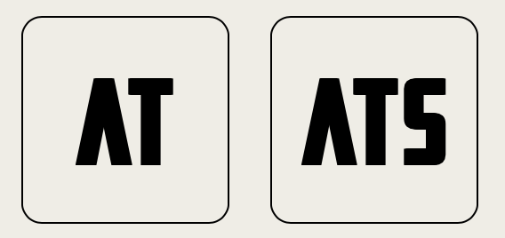
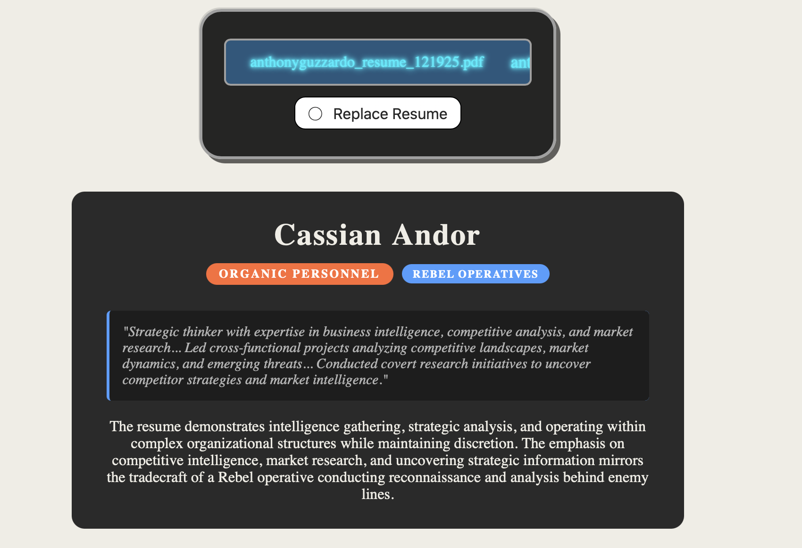

# AT-ATs


## A Star Wars Themed Applicant Tracking System

<p align="center">
  
</p>

Upload your resume and get matched with a Star Wars character based on your experience, skills, and career trajectory.

<p align="center">
  
</p>

## How it Works

1. Upload your resume (PDF or Markdown)
2. Claude analyzes your experience and skills
3. Get matched with a Star Wars character and designation
4. See the evidence and reasoning behind your match

## Ranking Categories

The system assigns your resume to a Star Wars-inspired category based on your background.

```
Force-Sensitive
├─ Jedi
│  ├─ Youngling
│  ├─ Padawan
│  ├─ Knight
│  └─ Master
├─ Sith
│  ├─ Apprentice
│  └─ Lord
└─ Neutral
   ├─ Force Adepts
   └─ Unaffiliated Sensitives

Droids
├─ Astromech
├─ Protocol
├─ Medical
├─ Battle
├─ Assassin
├─ Security
└─ Pilot

Organic Personnel
├─ Rebel Operatives / Spies
├─ Imperial Officers
├─ Civilians / Workers
├─ Soldiers
├─ Pilots
└─ Prisoners / Laborers

Cyborgs
└─ Technologically-Augmented

Non-Combat Roles
├─ Politicians
├─ Diplomats
├─ Intelligence
├─ Family or Support
└─ Bureaucrats
```

## Quick Examples

| Designation | Character Examples |
|-------------|-------------------|
| Jedi Master | Yoda, Mace Windu |
| Jedi Knight | Obi-Wan Kenobi, Luke Skywalker |
| Sith Lord | Darth Sidious (Palpatine) |
| Astromech Droid | R2-D2, R4-P17 |
| Protocol Droid | C-3PO |
| Imperial Officer | Dedra Meero, Orson Krennic |
| Rebel Operative | Cassian Andor, Luthen Rael |
| Cyborg | General Grievous |
| Politician | Padme Amidala, Mon Mothma |

## Setup

```bash
# Install dependencies
npm install

# Create .env file with your Anthropic API key
echo "ANTHROPIC_API_KEY=your_key_here" > .env

# Build and run
npm run dev
```

Open http://localhost:3000 in your browser.

## Tech Stack

- **Frontend**: Vanilla HTML/CSS/TypeScript
- **Backend**: Node.js HTTP server (no framework)
- **AI**: Claude API (claude-sonnet-4-5-20250929)
- **Build**: TypeScript compiler
